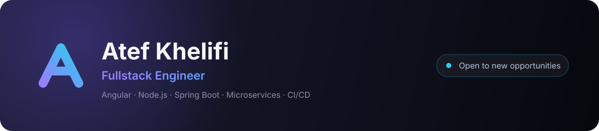

## Hi, I'm Atef 👋

Fullstack engineer from **Tunisia**. I build complete web applications — from the RESTful API
to the Angular interface — with an eye on architecture, performance and the quality of what
actually ships.

- 🔭 Frontend Engineer at **Smartconseil** — Angular 18, NgRx, PrimeNG, Angular Material
- 🧱 End-to-end before that: **Node.js / Express / PostgreSQL** and **Spring Boot / Oracle**
- 🧩 Microservices, REST APIs, NgRx state management, Docker and CI/CD pipelines
- 👥 I also lead: frontend supervision, code reviews, agile delivery, mentoring
- 🌍 French & English
- 📫 Reach me at **<khelifiatef@outlook.fr>**

  
  
  

---

### 🧰 Tech I work with

  <b>Frontend</b> 
  
  
  
  
  
  
  
  
  

  <b>Backend</b> 
  
  
  
  
  
  
  

  <b>Data</b> 
  
  
  
  

  <b>DevOps &amp; architecture</b> 
  
  
  
  
  
  
  
  

---

### 🚀 Featured projects

| Project | What it does | Built with |
| --- | --- | --- |
| [**E-Commerce-frontend**](https://github.com/atefkhelifi/E-Commerce-frontend) | E-commerce storefront structured as an Nx monorepo | Angular 18 · Nx |
| [**Messenger-clone-front**](https://github.com/atefkhelifi/Messenger-clone-front) | Real-time messaging client with auth and a responsive UI | Angular 19 · Socket.IO |
| [**microservices-project**](https://github.com/atefkhelifi/microservices-project) | Microservices platform with service discovery, centralised configuration and routing | Spring Boot · Spring Cloud |
| [**Blog-frontend**](https://github.com/atefkhelifi/Blog-frontend) | Multi-author blogging platform with real-time comments | Angular 16 · MEAN |
| [**doctor-app**](https://github.com/atefkhelifi/doctor-app) | Suggests which doctor to consult from symptoms, then finds the nearest one | Spring Boot · PostgreSQL |
| [**medical-specialist-detector-api**](https://github.com/atefkhelifi/medical-specialist-detector-api) | Flask API that suggests a medical specialist via Gemini AI | Python · Flask · Gemini |

---

### 📊 GitHub at a glance

  

---

  <a href="https://atefkhelifi.github.io/smart-portfolio/"><b>Portfolio</b></a> ·
  <a href="https://www.linkedin.com/in/atef-khelifi">LinkedIn</a> ·
  <a href="mailto:khelifiatef@outlook.fr">Email</a>

